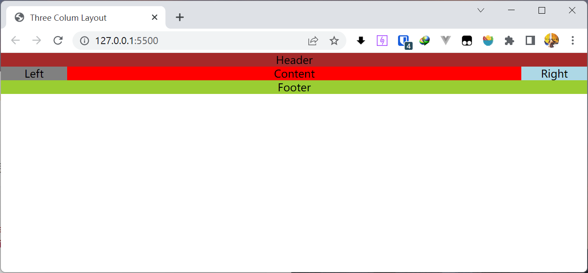

##### Blurry Loading，模糊缓慢加载一张图片

- 使用带`preload`属性`link`标签预加载这张非常大的图片

  ```html
  <link
      rel="preload"
      href="https://images.unsplash.com/photo-1572276596237-5db2c3e16c5d?ixlib=rb-1.2.1&ixid=eyJhcHBfaWQiOjEyMDd9&auto=format&fit=crop&w=2040&q=80"
      as="image"
  />
  ```

* 使用`filter`中的`blur`方法来设置图片的模糊程度，即多少像素会合并为一个

  ```css
  body {
      height: 100vh;
      overflow: hidden;
      display: flex;
      align-items: center;
      justify-content: center;
      padding: 0;
      margin: 0;
  }
  
  .container {
      position: absolute;
      margin: -50px -50px;
      height: calc(100vh + 100px);
      width: calc(100vw + 100px);
      background: center center / cover no-repeat
          url("https://images.unsplash.com/photo-1572276596237-5db2c3e16c5d?ixlib=rb-1.2.1&ixid=eyJhcHBfaWQiOjEyMDd9&auto=format&fit=crop&w=2040&q=80");
      filter: blur(50px);
  }
  
  .timer {
      display: none;
      font-size: 60px;
      color: #eee;
  }
  ```
  
  同时使用`flex`布局来保证`.timer`这个加载程度字体水平垂直居中，有趣的一点是由于.`container`的定位是`absolute`导致这个元素并不符合`flex`布局
  
* 使用`requestAnimationFrame`来设置这个动画过程，同时通过`RAF`给回调函数传入的高精度的调用时间戳来计算每次每一帧调用的时间间隔。保证至少隔`30ms`才执行一次回调逻辑

  同时保证加载完了图片之后才开始动画。

  ```js
  let container, timerText;
  window.addEventListener("load", () => {
      container = document.querySelector(".container");
      timerText = document.querySelector(".timer");
      timerText.style.display = "block";
      let percentage = 0;
      let prev = 0;
      function blurring(now) {
          /* 至少30ms再执行 */
          if (now - prev > 30) {
              percentage++;
              timerText.innerText = `${percentage}%`;
              timerText.style.opacity = `${((100 - percentage) * 1) / 100}`;
              container.style.filter = `blur(${
                  ((100 - percentage) * 50) / 100
              }px)`;
              prev = now;
          }
          if (percentage < 100) {
              requestAnimationFrame(blurring);
          }
      }
      requestAnimationFrame(blurring);
  });
  ```


* 通过`padding`，`float:left`以及`margin-left`实现三栏布局 / 圣杯布局

  直接创建一个`BFC`来清除浮动

  ```css
  * {
      box-sizing: border-box;
      padding: 0;
      margin: 0;
  }
  
  body {
      text-align: center;
  }
  /* 工具类 */
  .clear-fix {
      display: flow-root;
  }
  
  /* Header */
  header {
      background: brown;
  }
  
  /* MAIN */
  /* 确定左右部分宽度 */
  main {
      padding: 0 100px;
  }
  
  /* 全部左浮动 */
  main > div {
      float: left;
  }
  
  /* 中间部分占全部 */
  main .content {
      width: 100%;
      background: red;
  }
  
  /* 通过margin-left去到整个content-box的最左侧 */
  main .left {
      margin-left: -100%;
      width: 100px;
      position: relative;
      left: -100px;
      background: grey;
  }
  
  /* 通过margin-left按照浮动流移动到content-box的最右侧 */
  main .right {
      width: 100px;
      margin-left: -100px;
      position: relative;
      left: 100px;
      background: lightblue;
  }
  
  /* Footer */
  footer {
      background: yellowgreen;
  }
  
  ```

  ```html
  <!DOCTYPE html>
  <html lang="en">
      <head>
          <meta charset="UTF-8" />
          <meta http-equiv="X-UA-Compatible" content="IE=edge" />
          <meta name="viewport" content="width=device-width, initial-scale=1.0" />
          <link rel="stylesheet" href="style.css" />
          <title>Three Colum Layout</title>
      </head>
      <body>
          <header>Header</header>
          <main class="clear-fix">
              <div class="content">Main</div>
              <div class="left">Left</div>
              <div class="right">Right</div>
          </main>
          <footer>Footer</footer>
          <script src="./index.js"></script>
      </body>
  </html>
  ```

* 双飞翼布局

  使用一个`div`包装以下中间的`content`，这样能够直接让第一个div占据`100%`的宽度，也就能够更加方便地操作左右浮动元素在浮动流中移动，同时`content div`能够直接通过`calc`得到自身宽度然后进行居中

  ```html
  <header>Header</header>
  <main class="clear-fix">
      <div class="content-section">
          <div class="content">Content</div>
      </div>
      <div class="left">Left</div>
      <div class="right">Right</div>
  </main>
  <footer>Footer</footer>
  ```

  双飞翼的三栏布局

  ```css
  
  /* MAIN */
  /* 将真正的内容div包在另一个div中 */
  /* 同样都左浮动 */
  main > div {
      float: left;
  }
  
  /* 第一个div占据全部位置 */
  .content-section {
      width: 100%;
  }
  
  /* 真正的content就可以通过margin居中啦 */
  .content {
      margin: 0 100px;
      background: red;
  }
  
  /* 另外两个div同样利用margin-left移动到所属位置 */
  .left {
      width: 100px;
      margin-left: -100%;
      background: grey;
  }
  
  .right {
      width: 100px;
      margin-left: -100px;
      background: lightblue;
  }
  ```
  
也能照样使用`padding`实现`content`的居中
  
```css
  /* 第一个div占据全部位置 */
  .content-section {
      width: 100%;
      padding: 0 100px;
  }
  
  /* 真正的content直接就居中了 */
  .content {
      background: red;
  }
  ```
  


* 使用`flex`布局，让`content`作为第一个子元素首先加载但是使用`order:-1`使得`left`元素左移一位，`flex：1`是`flex-grow：1;`的缩写, 另外两个`flex item`直接指定宽度表示指定`flex-basis`即可

  ```html
  <header>Header</header>
  <main class="main">
      <div class="content">Content</div>
      <div class="left">Left</div>
      <div class="right">Right</div>
  </main>
  <footer>Footer</footer>
  ```

  以下为样式

  ```css
  /* flex布局 */
  main {
      display: flex;
  }
  
  .content {
      flex: 1;
      background: red;
  }
  
  /* 保证content首先加载，left使用order属性左移 */
  .left {
      width: 100px;
      background: grey;
      order: -1;
  }
  
  .right {
      width: 100px;
      background: lightblue;
  }
  ```

  `flex`布局中的几个关键词含义，一般也用不到

  - `initial`,表示根据宽高确定尺寸，可能会缩短自身来适应容器
  - `auto`，同样根据宽高确定，但是可能伸长也可能缩短
