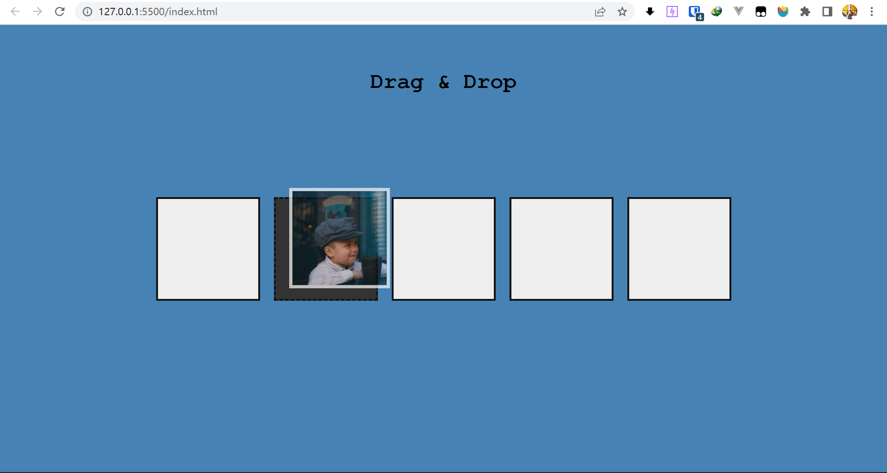

`Drag & Drop`

使用`draggable API`将一个图片实现为可拖拽元素，然后设置五个`frame`，使这个`image`可以在五个框直接随意移动。

- 将整个`container`设置为`flexbox`，并且让所有元素垂直居中对齐。

- 在小屏幕上将`flex-direction`设置为`colum`。同时整个`body`元素设置为`overflow-hidden`

- 由于有图片的那个框的`flex-basis`默认比较大，故而在`shrink`的时候会优先考虑没有内容的图片。`flex`智能的地方就在这儿了

- `drag`相关的事件一共有六个，前两个是用于监控被拖拽的元素，后面四个是用于拖放的时候`放`的所在

  - `dragstart`方法，一般可拖拽的元素包括图像，链接，选择的文本，其他的元素默认是不可拖拽的，这里的`image`元素本质上是一个`div`，给定的是背景图片，故而默认不可拖拽

    在`HTML`中给元素添加了一个属性`draggable`同时设为`true`

    接下来就是为dragstart事件设置事件监听，可以通过`e.dataTransfer.setData`方法设置拖拽数据，反馈图像和拖拽效果。默认反馈图像时拖拽的那个元素。

    故而这里只给元素添加一个`hold class`这回给它添加一个边框，然后需要原元素在父元素中不可见，必须要等到`onDragStart`方法之后再去除样式，设为不可见，这里通过设置一个超时器实现

    ```js
    /* 开始拖拽的方法 */
    function onDragStart(e) {
        this.classList.add("hold");
        /* 等到已经拖拽完成后再从原位置去掉图片 */
        setTimeout(() => {
            this.classList.remove("image");
            this.parentNode.classList.remove("filled");
        }, 0);
    }
    ```

    同理，一旦拖拽结束都会在被拖拽元素上触发dragend方法，以下设置事件监听，完成正好相反的逻辑

    ```js
    /* 拖拽结束的方法，这里的方法都是作用域被拖拽的对象 */
    function onDragEnd(e) {
        this.classList.add("image");
        this.classList.remove("hold");
        this.parentNode.classList.add("filled");
    }
    ```

    剩下四个方法都是作用于拖拽到的位置的元素，同时在`onDragOver`以及`onDragEnter`方法要通过一定的逻辑判断是否可以`drop`在这儿，如果可以就要调用`e.preventDefault()`, 这时候，鼠标附近就不会有一个×表示无法拖拽，以下时剩下四个方法的逻辑，这里都采用事件委托，因为要添加的监听事件过多。注意首先将`e.target`赋给一个`target`元素，然后再进行目标判断以及处理。由于是事件委托，`this`绑定的将永远是`container`。故而不能通过`this`判断，同时`this`不可直接进行赋值

    ```js
    /* 添加的onDragOver以及onDragEnter */
    function onDragOver(e) {
        const target = e.target;
        if (target !== container) {
            e.preventDefault();
        }
    }
    
    /* 拖拽入某个frame */
    function onDragEnter(e) {
        const target = e.target;
        if (target !== container) {
            e.preventDefault();
            target.classList.add("hovered");
        }
    }
    
    /* 离开某个frame */
    function onDragLeave(e) {
        const target = e.target;
        if (target !== container) {
            target.classList.remove("hovered");
        }
    }
    
    /* drop就意味着将图片移动到这里来 */
    function onDragDrop(e) {
        const target = e.target;
        if (target !== container) {
            /* 去除边框 */
            target.classList.remove("hovered");
            /* 设置大小，即当前的frame时filled了 */
            target.classList.add("filled");
            image.classList.remove("hold");
            target.append(image);
        }
    }
    ```

    然后分别是页面结构以及`CSS`

    ```html
    <head>
        <meta charset="UTF-8" />
        <meta http-equiv="X-UA-Compatible" content="IE=edge" />
        <meta name="viewport" content="width=device-width, initial-scale=1.0" />
        <link rel="stylesheet" href="./css/style.css" />
        <title>Drag & Drop</title>
    </head>
    <body>
        <header>
            <div class="logo">Drag & Drop</div>
        </header>
        <div class="container">
            <div class="frame filled">
                <div class="image" draggable="true"></div>
            </div>
            <div class="frame"></div>
            <div class="frame"></div>
            <div class="frame"></div>
            <div class="frame"></div>
        </div>
        <script src="./js/index.js"></script>
    </body>
    ```

    ```css
    * {
        font-family: "Courier New", Courier, monospace;
        padding: 0;
        margin: 0;
        box-sizing: border-box;
    }
    
    body {
        height: 100vh;
        overflow: hidden;
    }
    
    header {
        position: absolute;
        width: max-content;
        top: 10vh;
        left: 0;
        right: 0;
        margin: 0 auto;
    }
    
    header .logo {
        font-size: xx-large;
        font-weight: 700;
    }
    
    .container {
        width: 100%;
        height: 100%;
        background: steelblue;
        overflow: hidden;
        display: flex;
        justify-content: center;
        align-items: center;
    }
    
    .container .frame {
        width: 150px;
        height: 150px;
        margin: 10px;
        background: #eee;
        border: 3px solid #121312;
    }
    
    .frame .image {
        width: 145px;
        height: 145px;
        border: none;
        background-image: url("https://source.unsplash.com/random/150x150");
    }
    
    .frame .hold {
        border: 5px solid #eee;
    }
    
    .container .hovered {
        border: 3px dashed #121314;
        background: #333;
    }
    
    @media (max-width: 786px) {
        .container {
            flex-direction: column;
        }
    
        header {
            /* writing-mode: vertical-lr; */
            height: max-content;
            width: min-content;
            top: 0;
            bottom: 0;
            left: 5vw;
            margin: auto 0;
        }
    }
    ```

    