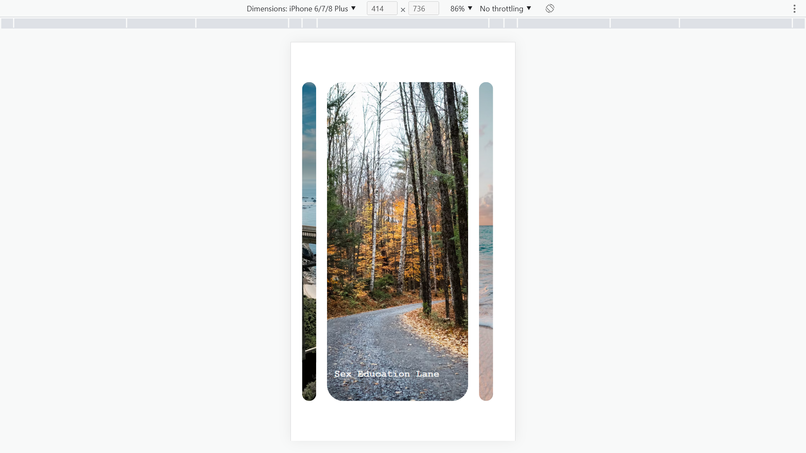

`Expanding Cards`实现点击然后扩大


首先将`ExpandCards`作为一个类，构造函数传入需要的图片数据，包括每张图片的连接以及描述文字。如下：

```js
const cardsInfo = [
    {
        url: "https://images.unsplash.com/photo-1558979158-65a1eaa08691?ixlib=rb-1.2.1&ixid=eyJhcHBfaWQiOjEyMDd9&auto=format&fit=crop&w=1350&q=80",
        specifics: "Big Little Lies",
    },
    {
        url: "https://images.unsplash.com/photo-1572276596237-5db2c3e16c5d?ixlib=rb-1.2.1&ixid=eyJhcHBfaWQiOjEyMDd9&auto=format&fit=crop&w=1350&q=80",
        specifics: "Sex Education Lane",
    },
    {
        url: "https://images.unsplash.com/photo-1507525428034-b723cf961d3e?ixlib=rb-1.2.1&ixid=eyJhcHBfaWQiOjEyMDd9&auto=format&fit=crop&w=1353&q=80",
        specifics: "Hello Sunny Beach",
    },
    {
        url: "https://images.unsplash.com/photo-1551009175-8a68da93d5f9?ixlib=rb-1.2.1&ixid=eyJhcHBfaWQiOjEyMDd9&auto=format&fit=crop&w=1351&q=80",
        specifics: "City Across Water",
    },
    {
        url: "https://images.unsplash.com/photo-1549880338-65ddcdfd017b?ixlib=rb-1.2.1&ixid=eyJhcHBfaWQiOjEyMDd9&auto=format&fit=crop&w=1350&q=80",
        specifics: "Mountains - Clouds",
    }
];


/* 初始化类 */
new ExpandCards(cardsInfo).init();
```

初始化方法如下，使用`documentFragment`进行离线文档操作。

```js
    /* 初始化方法 */
    init() {
        const fragment = document.createDocumentFragment();
        for (const card of this.cardsInfo) {
            const cardDiv = document.createElement("div");
            cardDiv.classList.add("panel");
            cardDiv.style.background = `center center / cover no-repeat url("${card.url}")`;
            const h3 = document.createElement("h3");
            h3.innerText = card.specifics;
            h3.classList.add("info");
            cardDiv.appendChild(h3);
            fragment.appendChild(cardDiv);
        }
        fragment.firstElementChild.classList.add("active");
        this.expandingCards.appendChild(fragment);
        this.cardList[0].firstElementChild.style.display = "block";

        /* 添加事件监听 */
        this.expandingCards.addEventListener("click", (e) => {
            /* 修改事件监听函数的this指向 */
            this.clickOnCard.call(this, e);
        });
    }
```

也可以直接使用`innerHTML`进行初始化

```js
    /* 初始化方法 */
    init() {
        this.expandingCards.innerHTML = this.cardsInfo.reduce(
            (prev, cur) =>
                prev +
                `<div class="panel" style = "background: center center / cover no-repeat url('${cur.url}')"><h3 class="info">${cur.specifics}</h3></div>`,
            ""
        );
        this.cardList[0].classList.add("active");
        this.cardList[0].firstElementChild.style.display = "block";

        /* 添加事件监听 */
        this.expandingCards.addEventListener("click", (e) => {
            /* 修改事件监听函数的this指向 */
            this.clickOnCard.call(this, e);
        });
    }
```

然后给整个组件标签添加事件监听，只要点到了任意一个子元素就开始进行过渡转换

```js
    /* 监听整个expandingCards的Dom对象 */
    clickOnCard(e) {
        let target = e.target;
        if (target !== this.expandingCards) {
            /* 如果索引改变了则修改active对象 */
            let targetIndex = Array.from(this.cardList).indexOf(target);
            if (targetIndex !== this.index) {
                this.index = targetIndex;
                this.transformTo();
            }
        }
    }
```

**PS :**	事件监听的函数不论是作为实例对象上的一个方法还是一个原型方法，在作为一个`click`事件监听方法其`this`对象都会被重写为监听的对象，故而要使用`apply`将`this`重写为实例对象的`this`。由于箭头函数会保留创建的上下文`this`，故而可以直接`apply/call`

在监听函数中得到要放大图片的索引然后改变全局的`index`并且调用`transform`函数

```js
    transformTo() {
        /* 修改active对象 */
        for (const card of this.cardList) {
            if (card.classList.contains("active")) {
                card.classList.remove("active");
                card.firstElementChild.style.display = "none";
            }
        }
        this.cardList[this.index].classList.add("active");
        /* 1s后展示文字 */
        setTimeout(() => {
            this.cardList[this.index].firstElementChild.style.display = "block";
        }, 1000);
    }
```

设置`container`的宽高然后通过`margin`设置居中，并且通过`padding`设置子元素居中

```css
.container {
    width: 90%;
    height: 100vh;
    overflow: hidden;
    margin: auto;
    padding: 10vh 0;
}
```

`css`如下

```css
* {
    padding: 0;
    margin: 0;
    box-sizing: border-box;
    font-family: "Courier New", Courier, monospace;
}

.container {
    width: 90%;
    height: 100vh;
    overflow: hidden;
    margin: auto;
    padding: 10vh 0;
}

.expanding-cards {
    display: flex;
    height: 100%;
}

.expanding-cards .panel {
    flex: 0.5;
    cursor: pointer;
    border-radius: 30px;
    margin-right: 20px;
    transition: flex ease-in 1s;
}

.expanding-cards .panel:last-of-type {
    margin-right: 0;
}

.expanding-cards .panel .info {
    display: none;
}

.expanding-cards .active {
    flex: 5;
}

.expanding-cards .active .info {
    font-size: 28px;
    font-weight: 600;
    position: relative;
    top: 90%;
    left: 5%;
    color: #eee;
}

@media (max-width: 856px) {
    .expanding-cards .active .info {
        font-size: large;
    }

    /* 最多只能保留3个panel */
    .expanding-cards .panel:nth-child(1n + 4) {
        display: none;
    }
}
```


