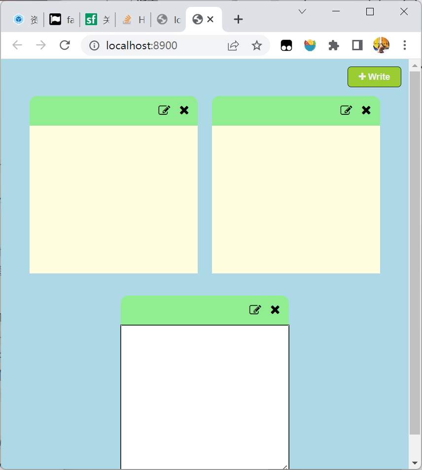

##### Notes App



使用`webpack`打包做的小页面，主要是熟悉一下怎么使用`webpack`。

在使用`webpack dev server`实现热更新的时候，发现使用`html-webpack-plugin`从模板中编译出来的html文件并不会真正地进行热更新，需要刷新之后才能有效果。之前一直就用`live server`这个小插件来进行地热更新，但是它的缺陷就是不管更新什么文件就会完全刷新然后跳到页面头部。

而`webpack`中的`HMR`即模块热替换是指在尽量不经过刷新的情况下将页面所引用的`js`或者`css`等模块进行热替换。当然如果`webpack`在热替换检查失败的情况下会刷新整个页面。

而如果需要在`html`文件更新后也让页面进行刷新的话。解决方法之一就是让`html`文件也成为模块。直接在入口文件中`require`需要热加载的`html`文件。同时设置`raw-loader`来将指定后缀(这里是`html`)的文件导出为字符串，在`webpack5`提供的4种资源模块类型中与之相对应的是`asset/source`, 然而它的作用分为两步，将`txt`等文件导入为字符串，并且会原样注入到`bundle`中，同时它还会识别`html-webpack-plugin`中的模板文件，也就是会识别两次，变得有点混乱。

故而使用`raw-loader`来进行资源转换。它仅仅只会转换，并且`webpack`会帮忙`watch`它，类似`npx webpack watch`开启观察模式同样会观察`index.html`也就是模板，不需要引入，只不过问题就是不会自动更新，故而这里需要使用`raw-loader`来进行一如，然后`webpack`就会`watch`它并且每次依赖图中的这个文件发生改变的时候就刷新一下`dev-server`。这种方法是可以和`html-webpack-plugin`一起使用的，完全没有任何副作用，就是在生产环境中要将它删除，因为多了一部分没有必要的东西。

```js
const path = require("path");
const HtmlWebpackPlugin = require("html-webpack-plugin");
const MiniCssExtractPlugin = require("mini-css-extract-plugin");

module.exports = {
    entry: {
        index: "./src/index.js",
    },
    output: {
        path: path.resolve(__dirname, "dist"),
        filename: "[name].bundle.js",
        clean: true,
    },
    devtool: "eval",
    devServer: {
        static: "./dist",
        port: 8900,
        hot: true,
    },
    module: {
        rules: [
            {
                test: /\.css$/i,
                use: [
                    MiniCssExtractPlugin.loader,
                    {
                        loader: "css-loader",
                        options: {
                            sourceMap: true,
                        },
                    },
                ],
            },
            {
                test: /\.(html)$/i,
                use: "raw-loader",
            },
        ],
    },
    plugins: [
        new HtmlWebpackPlugin({
            template: "./src/index.html",
        }),
        new MiniCssExtractPlugin({
            filename: "[name].css",
        }),
    ],
    mode: "development",
};
```

除了使用`raw-loader`, 的确可以对后缀为`html`的文件配置`asset/source`来进行转换，不过它同样对`html-webpack-plugin`使用转换，故而`test`的对象不应该是所有引入的html文件。最后只针对这一个引入可以使用资源查询条件或者内联语法。

官网上推荐的是使用资源查询来模仿内联语法，可以有同样灵活的配置，同时聚集在一个地方。如果需要更加灵活还可以在资源查询中时候`not`关键字配合正则，或者`oneOf`关键字

如下：

```js
{
    resourceQuery: /raw/,
        type: "asset/source",
},
```

然后在入口中引入

```js
require("./index.html?raw");
```

这样也没必要下载`raw-loader`这个插件了

这个页面主要是进行事件监听，监听每次点击`write`按钮，则将内部的`textarea`设为`”display: none“,` 并且将另一个`p`元素的`display`设置为`block`，同时将`textarea`的value复制过来。实现一个书写状态的保存状态之间的转换，然后就是简单的添加以及删除

```js
require("./css/style.css");
require("./index.html?raw");

/* 拿到按钮 */
document.addEventListener("DOMContentLoaded", () => {
    const container = document.querySelector(".container");
    const addButton = document.querySelector(".add-btn");
    addButton.addEventListener("click", () => {
        addNote(container);
    });
    /* 添加另外两个按钮的事件处理程序，添加到document对象上 */
    document.addEventListener("click", (e) => handleClick(e, container));
});

/* 点击按钮添加一个note组件 */
function addNote(container) {
    const noteDiv = document.createElement("div");
    noteDiv.classList.add("note-div");
    noteDiv.innerHTML = `
        <div class="note-header">
            <div class="write">
                <i class="fa fa-pencil-square-o" aria-hidden="true"></i>
            </div>
            <div class="remove">
                <i class="fa fa-times" aria-hidden="true"></i>
            </div>
        </div>
        <div class="note-body write-mode">
            <p class="text"></p>
            <textarea class="note-text" cols="30" rows="10"> </textarea>
        </div>`;
    container.appendChild(noteDiv);
    /* 焦点放在新创建的位置 */
    noteDiv.getElementsByClassName("note-text")[0].focus();
}

// 点击两个按钮的事件处理程序
function handleClick(e, container) {
    const target = e.target;
    /* 如果是点击了write按钮 */
    if (
        target.classList.contains("write") ||
        target.classList.contains("fa-pencil-square-o")
    ) {
        /* 拿到所要处理结点note-body */
        let noteHeader = target.parentNode;
        while (!noteHeader.classList.contains("note-header")) {
            noteHeader = noteHeader.parentNode;
        }
        const noteBody = noteHeader.nextElementSibling;
        noteBody.classList.toggle("write-mode");
        if (!noteBody.classList.contains("write-mode")) {
            noteBody.firstElementChild.innerText =
                noteBody.lastElementChild.value;
        } else {
            noteBody.lastElementChild.focus();
        }
    } else if (
        target.classList.contains("remove") ||
        target.classList.contains("fa-times")
    ) {
        let noteDiv = target.parentNode;
        while (!noteDiv.classList.contains("note-div")) {
            noteDiv = noteDiv.parentNode;
        }
        console.log(noteDiv, noteDiv.parentNode);
        container.removeChild(noteDiv);
    }
}
```

css如下：

```css
* {
    padding: 0;
    margin: 0;
    box-sizing: border-box;
    font-family: Arial, Helvetica, sans-serif;
}

body {
    background: lightblue;
}

/* 工具类 */
.btn {
    padding: 6px 14px;
    background: yellowgreen;
    color: #eee;
    border: 1px solid #1e1e1e;
    border-radius: 5px;
    cursor: pointer;
}

.container {
    padding: 50px 20px 0;
    display: flex;
    justify-content: space-evenly;
    flex-wrap: wrap;
}

/* 按钮 */
.add-btn {
    position: absolute;
    text-align: center;
    right: 10px;
    top: 10px;
    font-weight: 600;
    font-size: 12px;
}

/* 每个具体的note */
.note-div {
    width: 30vw;
    height: 40vh;
    min-height: 240px;
    margin-bottom: 30px;
}

/* Note Header */
.note-header {
    width: 100%;
    height: 40px;
    border-top-left-radius: 10px;
    border-top-right-radius: 10px;
    background: lightgreen;
    display: flex;
    justify-content: end;
    align-items: center;
    padding: 12px;
}

.note-header .remove {
    margin-left: 12px;
    padding-bottom: 2px;
    font-size: 17px;
    cursor: pointer;
}

.note-header .write {
    cursor: pointer;
}

/* Note body */
.note-body {
    width: 100%;
    height: calc(100% - 40px);
    background: lightyellow;
}

.note-body .text {
    padding: 10px;
}

.note-text {
    width: 100%;
    height: 100%;
    padding: 10px;
    display: none;
}

.write-mode .note-text {
    display: block;
}

.write-mode .text {
    display: none;
}

.note-text:focus {
    outline: 1px solid #1e1e1e;
}

@media screen and (max-width: 1100px) {
    .note-div {
        width: 40vw;
    }
}
```

