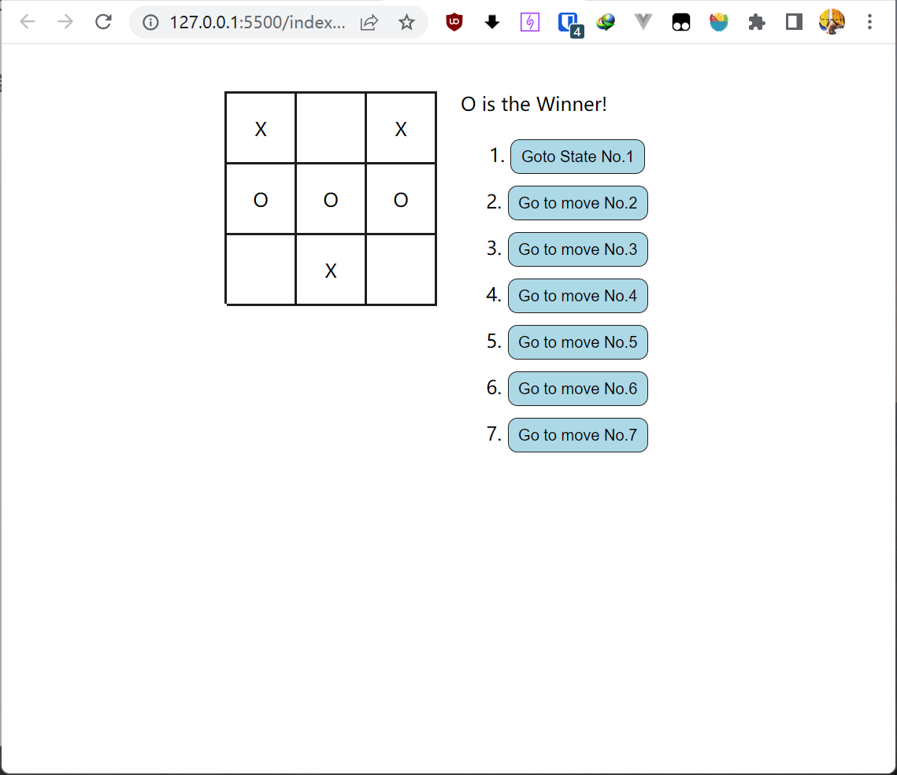

##### 原生JavaScript版井字棋 Tictactoe



- 关键是维护一个全局的`histories`索引，保存每个状态下的`3×3`的数组。

  同时记录当前所在`histories`数组中的索引。主要有两个监听事件。

- 事件一是下棋`onMove`事件。

  - 首先判断当前能不能下，因为如果已经有一方获胜则不能落子了
  - 然后判断当前所在索引是否不是最后一个，如果不是则需要首先更新`histories`数组的长度以及去除视图右边历史列表中多余的部分
  - 然后才开始添加新的历史记录，并且更新视图。
  - 关键是在点击某个格子的时候要得知其具体的位置，可以直接给每个格子元素一个自定义数据属性`data-index`。这样就不用通过数的方式得到索引了。当然对于框架而言，是直接根据当前的`historys`生成新的虚拟`DOM`，然后由框架来操作真实的`DOM`元素要更新的部分

- 事件二就是回退事件了

  - 点击某个按钮就更新当前所在的`index`，然后直接得到新的`innerHTML`直接更新，因为判断哪个部分需要修改可能过于复杂。所以直接`innerHTML`，当然是需要有实质的`index`变化才更新
  - 同时如果是修改到了最后一个按钮，可能是有获胜方的状态

- 然后就是判断是否的获胜方的方法了。由于记录当前状态采用的是一个三维数组，并且如果下了棋的位置要么是`+1`要么是`-1`，故而可以直接遍历一遍对三行三列以及两条交叉轴进行求和，如下为`Game`类

  ```js
  export default class Game {
      constructor(container) {
          this.container = container;
          this.histories = [
              new Array(3).fill(0).map((cell) => new Array(3).fill(0)),
          ];
          this.curHistoryIndex = 0;
          /* 当前下的棋子类型 */
          this.nextPlayer = "X";
          this.onMove = this.onMove.bind(this);
          this.gotoState = this.gotoState.bind(this);
          /* 当前是否胜方 */
          this.won = false;
      }
  
      init() {
          this.board = document.createElement("div");
          const detailDiv = document.createElement("div");
          detailDiv.classList.add("detail");
          detailDiv.innerHTML = `<div class="status">Next Run: X</div>
                                  <div class="histories"><div>1.<button class="goto">Goto State No.1</button></div></div>`;
          this.statusDiv = detailDiv.querySelector(".status");
          this.historiesDiv = detailDiv.querySelector(".histories");
          this.board.classList.add("board");
          this.board.innerHTML = this.getBoard();
          this.container.appendChild(this.board);
          this.container.appendChild(detailDiv);
  
          /* 添加事件监听 */
          this.board.addEventListener("click", this.onMove);
          this.historiesDiv.addEventListener("click", this.gotoState);
      }
  
      getBoard() {
          let curHistory = this.histories[this.curHistoryIndex];
          let htmlStr = "";
          for (let i = 0; i < 3; i++) {
              /* 拼接每一行 */
              htmlStr += "<div class='row'>";
              for (let j = 0; j < 3; j++) {
                  switch (curHistory[i][j]) {
                      case -1: {
                          htmlStr += `<div class='cell' data-index='${i},${j}'>X</div>`;
                          break;
                      }
                      case 0: {
                          htmlStr += `<div class='cell' data-index='${i},${j}'></div>`;
                          break;
                      }
                      case 1: {
                          htmlStr += `<div class='cell' data-index='${i},${j}'>O</div>`;
                          break;
                      }
                      default: {
                          break;
                      }
                  }
              }
              htmlStr += "</div>";
          }
          return htmlStr;
      }
  
      // 落子
      onMove(e) {
          let target = e.target;
          if (
              this.won === false &&
              target !== this.board &&
              target.innerText === ""
          ) {
              /* 如果当前所在的历史index比histories数组的总长度要小，说明要先去除一部分 */
              let len = this.histories.length;
              if (this.curHistoryIndex < len - 1) {
                  /* 直接更新长度 */
                  len = this.curHistoryIndex + 1;
                  this.histories.length = len;
                  /* 先删除多余的按钮 */
                  while (this.historiesDiv.childElementCount > len) {
                      this.historiesDiv.removeChild(
                          this.historiesDiv.lastElementChild
                      );
                  }
              }
  
              /* 更新视图 */
              target.innerText = this.nextPlayer;
              this.historiesDiv.innerHTML += `<div>${
                  len + 1
              }.<button class='goto'>Go to move No.${len + 1}</button></div>`;
  
              /* 新增历史，注意克隆 */
              const curHistory = this.histories[this.curHistoryIndex];
              const newHistory = curHistory.map((row) => [...row]);
              /* 拿到所在坐标 */
              const index = target.dataset.index.split(",");
              newHistory[index[0]][index[1]] = this.nextPlayer === "X" ? -1 : 1;
              this.histories.push(newHistory);
              this.curHistoryIndex++;
              /* 判断是否有胜方 */
              if (this.judgeWinner() === true) {
                  this.statusDiv.innerHTML = `${this.nextPlayer} is the Winner!`;
                  this.won = true;
              } else {
                  /* 更新nextPlayer */
                  this.nextPlayer = this.nextPlayer === "X" ? "O" : "X";
                  this.statusDiv.innerText = `Next Run:${this.nextPlayer}`;
              }
          }
      }
  
      // 跳转到之前的状态
      gotoState(e) {
          const target = e.target;
  
          if (target !== this.historiesDiv) {
              /* 得到点击的编号 */
              const buttons = this.historiesDiv.querySelectorAll(".goto");
              const index = [...buttons].indexOf(target);
  
              /* 更新board为之前的状态 */
              if (index !== this.curHistoryIndex) {
                  this.curHistoryIndex = index;
                  this.board.innerHTML = this.getBoard();
  
                  this.won = false;
                  /* 同时更新nextPlayer,偶数则为X*/
                  if ((index & 1) === 1) {
                      this.nextPlayer = "O";
                  } else {
                      this.nextPlayer = "X";
                  }
                  this.statusDiv.innerText = `Next Run ${this.nextPlayer}`;
  
                  /* 如果index变到了最后一个位置，判断是否出现了胜方 */
                  if (
                      index === this.histories.length - 1 &&
                      this.judgeWinner() === true
                  ) {
                      this.won = true;
                      const winner = this.nextPlayer === "X" ? "O" : "X";
                      this.statusDiv.innerText = `${winner} is the Winner!`;
                  }
              }
          }
      }
  
      // 判断当前是否某一方赢了
      judgeWinner() {
          const curHistory = this.histories[this.curHistoryIndex];
  
          /* 统计三行三列以及两条交叉线的和 */
          const sumArr = new Array(8).fill(0);
          for (let i = 0; i < 3; i++) {
              for (let j = 0; j < 3; j++) {
                  /* 所在的和 */
                  sumArr[i] += curHistory[i][j];
                  /* 所在列的和 */
                  sumArr[3 + j] += curHistory[i][j];
                  /* 右斜行 */
                  if (i - j === 0) {
                      sumArr[6] += curHistory[i][j];
                  }
                  /* 左斜行 */
                  if (i + j === 2) {
                      sumArr[7] += curHistory[i][j];
                  }
              }
          }
  
          return sumArr.some((sum) => sum === 3 || sum === -3);
      }
  }
  ```

* 要实现九个格子可以使用`float`一个一个堆下来，用`flex`也可以，同时按钮列表应该直接使用列表比较方便，这里还是用了flex，不过修改了一下`flex-direction`

  ```css
  * {
      padding: 0;
      margin: 0;
      box-sizing: border-box;
  }
  
  .container {
      max-width: 800px;
      margin: 0 auto;
      padding: 40px;
      display: flex;
      justify-content: center;
  }
  
  .container .board {
      width: 180px;
      height: 180px;
      border-left: 2px solid #1e1e1e;
      border-top: 2px solid #1e1e1e;
      margin-right: 20px;
  }
  
  .board .row {
      display: flex;
  }
  
  /* 让文本垂直居中，不设置为table-cell */
  /* 因为只有一个符号，直接设置line-height */
  .row .cell {
      width: 60px;
      height: 60px;
      border-right: 2px solid #1e1e1e;
      border-bottom: 2px solid #1e1e1e;
      text-align: center;
      line-height: 60px;
      overflow: hidden;
  }
  
  .container .detail {
      width: 180px;
      min-height: 180px;
      display: flex;
      flex-direction: column;
      justify-content: flex-start;
  }
  
  .detail .status {
      width: 100%;
  }
  
  .detail .histories {
      margin-top: 20px;
      width: 100%;
      display: flex;
      flex-direction: column;
      align-items: center;
  }
  
  .histories .goto {
      margin-left: 5px;
      margin-bottom: 10px;
      padding: 6px 8px;
      background: lightblue;
      border-radius: 8px;
      border: 1px solid #1e1e1e;
      cursor: pointer;
  }
  ```

  

